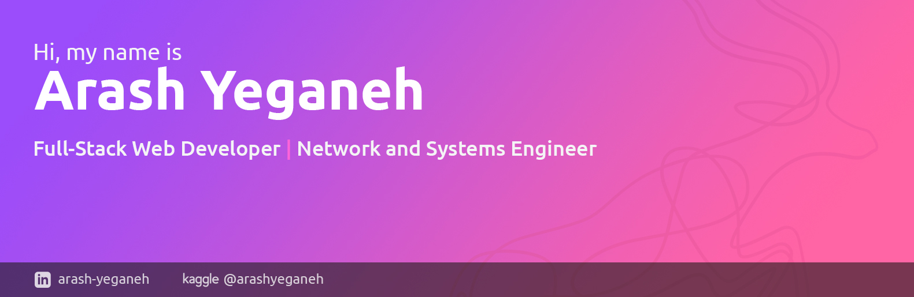

<-- Social Network -->

<-- Skill -->

The first sparks of my familiarity with technology were when I got to know Atmel's Atmega 32 microcontroller chips. 

My great interest in learning and challenging myself has made me look at career issues with a deeper perspective.

 With the experience that I have gained in the last few years in the management of organizational network infrastructure and web programming, I decided to start working on a global scale and also  gain experience.

and share my experiences with those interested in this field.

---

<ul>
	<li>
		

			Fork my source code on 
			
		

	</li>
	<li>
		

			Follow me on
			
		

	</li>
	<li>
		

			Read my article on
			
		

	</li>
</ul>

